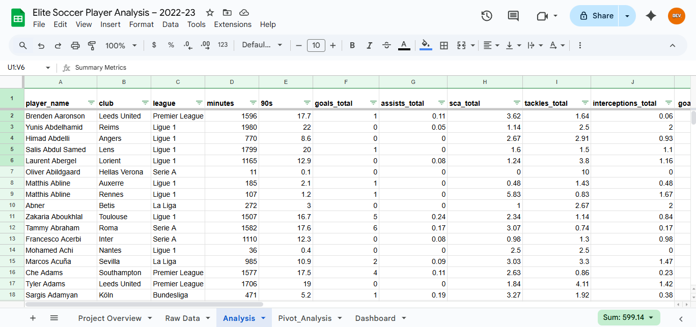

# ⚽ Elite Soccer Player Performance Analysis (2022–23)

  
  
  
  
  

---

## 📌 Project Overview
This project analyzes **football player performance data** from the 2022–23 season across Europe’s top leagues.  
The goal was to design a **data-driven ranking system** for players, similar to what a coach or analyst would use to evaluate performance.

The project was completed entirely in **Google Sheets** using formulas, pivot tables, and dashboards.

---

## 📂 Project Structure
- **Raw Data** → Original dataset of 499 players  
- **Analysis** → Cleaned dataset with calculated metrics  
  - Per 90 stats (Goals, Assists, Key Passes, Tackles, Interceptions)  
  - Weighted Performance Score  
  - Player Rank, Category (Attacker, Midfielder, Defender, GK), Tier  
- **Pivot Analysis** → Pivot tables to compare leagues & player roles  
- **Dashboard** → Visual representation of key insights  

---

## 📊 Key Insights
- **Total Players:** 499  
- **Average Goals per 90:** 0.12  
- **Average Assists per 90:** 0.02  
- **Top Scorer:** Ante Palaversa (Performance Score = 100)  
- **League Comparison:**  
  - Bundesliga had the highest **Assists per 90 (0.28)**  
  - Ligue 1 had the highest **Goals per 90 (0.14)**  
- **Category Comparison:**  
  - Midfielders had the most **Tackles & Interceptions per 90**  
  - Forwards contributed heavily in **Goals per 90**  

---

## 📸 Dashboard & Visuals
### Dashboard

### Pivot Analysis

### Analysis Tab

---

## 🛠️ Tools Used
- **Google Sheets** (Formulas, Pivot Tables, Conditional Formatting, Charts)  
- **Excel** (export for sharing)  

---

## 🚀 Deliverables
- Final Excel File → [`Elite_Soccer_Player_Analysis_2022_23.xlsx`](data/Elite_Soccer_Player_Analysis_2022_23.xlsx)  
- Interactive Google Sheets (https://docs.google.com/spreadsheets/d/1Z-sD6wM3HTnn426cl3cZzXsuY0FoLwsB8IbqiQeqlgg/edit?usp=sharing)  
- Dashboard screenshots  

---

## 📌 Project Level
- **Beginner:** Data Cleaning, Formulas, Conditional Formatting  
- **Intermediate:** Weighted Performance Score, Ranking System, Dashboards  

---

## 🧑‍💻 Portfolio Value
This project demonstrates:  
- Ability to **clean & prepare data**  
- Apply **custom formulas** for advanced metrics  
- Build **pivot tables & dashboards** to summarize insights  
- Communicate results visually & professionally  

✅ Suitable for **Data Analyst / Junior Data Scientist** portfolio.
